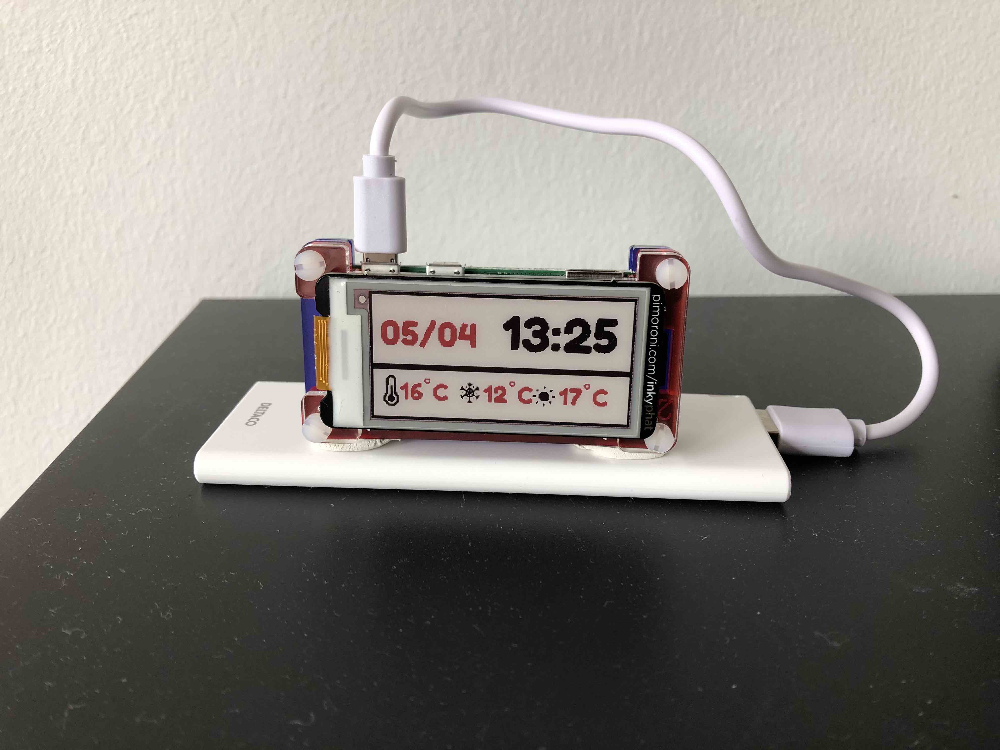

# Simple clock with temperature

## Components
* Raspian Strech
* Raspberry Pi Zero W with male connectors
* Pimoroni pHat InkyDisplay with red color
* Pimoroni case for the RPi Zero W
* Powerbank 3600mA+ USB cable (Last ~ 1 week)

## Info
* Based on the examples provided by Pimoroni
https://github.com/pimoroni/inky/blob/master/examples/phat/weather-phat.py
* Uses open weather map API (need to register for a free key)
* The key needs to be inserted in a new file called 'key.py' in the main root with the code `KEY={YOUR OPEN WEATHER API KEY}`
* Change the city code for yours...
* Updates every 5 min
* Configure RPi with local timezone and to boot directly to the pi user and add wifi configuration
* Launch the configure_service.sh script

